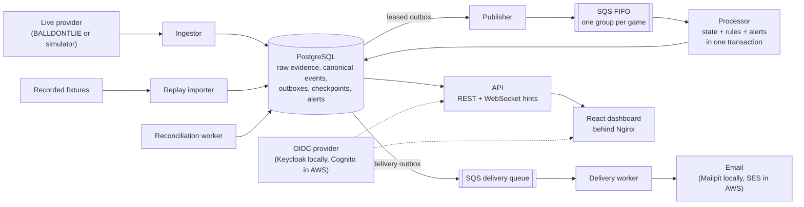

# CourtPulse

CourtPulse turns a basketball play-by-play feed into a durable event stream, keeps every game's
state current, evaluates each fan's alert rules exactly once, and pushes updates to the browser and
to email. It is a portfolio project about the hard parts of real-time systems: ordering,
idempotency, corrections, failure recovery, and proving all of it with tests and measurements.

> CourtPulse is an independent project with no affiliation to the NBA, any team, or any data
> provider. Real completed games are replayed from an unofficial public dataset for personal,
> non-commercial demonstration; live real-time data needs a BALLDONTLIE subscription, and its
> terms apply.

## What it does

- **Replays real NBA games** from the 2026 playoffs (or any imported season) play by play, as if
  live, at a speed you choose, with pause, resume, and skip-to-final in the browser.
- **Ingests** a live provider (BALLDONTLIE, or a local simulator of it) or recorded fixtures,
  keeping raw evidence and turning provider corrections into new revisions, not overwrites.
- **Processes** events in order per game through a PostgreSQL transactional outbox and SQS FIFO.
  Crashes and redeliveries can repeat work but never duplicate state or alerts.
- **Alerts** on structured rules (a player reaching N points, a close game late in a period, a
  scoring run), evaluated inside the same transaction that advances the game, then delivered
  in-app and by email with retries and a dead-letter queue.
- **Serves** a versioned REST API with ETags and cursors, WebSocket hints that fall back to
  polling, and a React dashboard with OIDC sign-in (PKCE).
- **Recovers** from lost dependencies without operator action, and **reconciles** gaps and
  corrections deterministically.
- **Ships** with CI, security scanning, local observability (traces across processes, alerts,
  dashboards), and Terraform for an AWS staging environment (written and validated, not applied).

## Architecture



PostgreSQL is the source of truth. Queues carry work, not state, and WebSocket messages are only
hints: a client that misses one resynchronizes over HTTP. The domain model has no infrastructure
dependencies, so the same events replay in memory, against PostgreSQL, or through SQS, and every
path must reproduce the same final-state checksum. The reasoning behind each choice is recorded in
[15 architecture decision records](docs/adr).

## Quick start

You need Docker Desktop (running), and for development Java 21 and Node.js 24. Then:

```bash
make demo          # or: scripts/demo.sh up
```

The first run builds the images and takes several minutes. It starts the whole system in its own
Compose project with generated local-only credentials (in the ignored `.env.demo`) and prints:

| | |
| --- | --- |
| Dashboard | http://127.0.0.1:4173 (use `127.0.0.1`, not `localhost`, for sign-in) |
| Replay real games | http://127.0.0.1:4173/replays |
| Email inbox (Mailpit) | http://127.0.0.1:8025 |
| API | http://127.0.0.1:8080/api/v1/games |

`make demo-status` shows it again, `make demo-down` stops it, and `make demo-destroy` deletes it.
Run `make` to see every workflow.

## Replay a real NBA game

On first start the demo downloads all 85 games of the 2026 NBA playoffs, first round through the
Finals (about 2 MB), from the open [nba_data](https://github.com/shufinskiy/nba_data) project.
Games through May 9 come from NBA.com live data with real timestamps; the rest come from
stats.nba.com play-by-play and are paced from the game clock. Sign in, open **Replays**, pick a game
and a speed, and press **Replay**: CourtPulse feeds the real play-by-play through the same pipeline
a live feed uses, so the scoreboard, box score, your alert rules, and email all react as they
would on game night. On the game page you can pause, change speed, skip to the final, or replay it
again. Import more with `make replay-import DATASET=cdnnba_2025` (the 2025-26 regular season).
Replays are verified end to end: `REAL_DATA=1 scripts/verify-replay.sh` replays real games and
checks that CourtPulse reproduces each official final score from the plays alone
([ADR 0015](docs/adr/0015-real-game-replay.md)).

## A walkthrough

1. Open the dashboard. Every game in the demo is a real 2026 playoff game; the Scores page fills
   as you replay them.
2. **Sign in** as `fan-a` (the password is in `.env.demo`). Sign-in is Authorization Code with
   PKCE against a local Keycloak; the API validates the token independently. Access tokens are
   short-lived by design; if you are signed out, **Sign in** returns you in one click.
3. On **Notifications**, add any address and enable email before your alerts fire. Nothing
   leaves your machine: Mailpit catches it.
4. On **Replays**, start a game at 10x or 30x. On its game page, **Follow** it and choose
   **Create alert**: pick a player from the suggestions and a points total they have not reached,
   or a *Close game* or *Scoring run* rule.
5. Watch the score update live. When the moment comes, a toast pops up wherever you are in the
   app, the alert appears in **My Alerts** with its delivery status, and the email arrives in
   Mailpit.

Scorer corrections, provider outages, and the live-provider path are exercised by the acceptance
harnesses (`scripts/verify-milestone-10.sh`, `scripts/verify-milestone-12.sh`), which use a
fictional game served by a local simulator; the demo itself shows only real games.

The `ops` user can read the operations API (provider health, delivery backlog); there is no
operations screen yet. For dashboards and traces, `make observability` starts a separate stack
with Grafana, Prometheus, and Tempo.

## Evidence

| Area | Result | Details |
| --- | --- | --- |
| Tests | 199 backend tests against real PostgreSQL and LocalStack containers, 66 web unit tests, Playwright end-to-end runs, and 11 acceptance harnesses | `make check`, [CI](.github/workflows/ci.yml) |
| Real games | Replays of real 2026 playoff games (including two overtime games) reproduce each official final score and apply every play, with no rejected plays | `REAL_DATA=1 scripts/verify-replay.sh` |
| Performance | Sustained 200 events/s across 50 games: p95 processing delay 82 ms (target 500 ms). 2,000 WebSocket clients see hints about 0.3 s after commit (target 2 s). 100,000 stored rules; a hot-game lookup takes 0.9 ms. | [Performance report](docs/verification/performance-report.md) |
| Recovery | Processor SIGKILL, PostgreSQL restart, 20 s SQS partition, and SIGTERM mid-publication all recover with exactly-once state and one alert per rule | [Recovery report](docs/verification/recovery-report.md) |
| Security | 0 fixable HIGH or CRITICAL image vulnerabilities, OWASP ZAP baseline with 0 warnings, no leaked secrets, OWASP API Top 10 mapping, per-client rate limits | [Scan report](docs/verification/security-scan-report.md), [threat model](docs/security/threat-model.md) |

Load testing found a real bottleneck (the publisher sent one message per call), and the failure
drills found five ways a brief outage could permanently stall a game. Both are fixed and written
up in [ADR 0014](docs/adr/0014-batched-publication-and-transient-retry.md).

## Technology

Java 21, Spring Boot 4, PostgreSQL 17 with Flyway, Amazon SQS FIFO (LocalStack locally), React 19
with TypeScript, Vite, and TanStack Query, Nginx, OIDC with Keycloak or Cognito, OpenTelemetry
with Tempo, Prometheus, and Grafana, Terraform for AWS (ECS Fargate, RDS, CloudFront, SES),
GitHub Actions, Testcontainers, Playwright, and k6.

## Repository layout

```text
modules/domain         events, game reducer, rules, checksum (no infrastructure)
modules/providers      fixture mapping, live provider boundary, BALLDONTLIE adapter
modules/persistence    Flyway migrations, JDBC repositories, checkpoints, outbox leases
modules/messaging      queue port, publisher and consumers, SQS and SES adapters
modules/query          read models, keyset cursors, data freshness
modules/observability  W3C trace context and span conventions
modules/testkit        synthetic fixtures and load games
apps/api               REST and WebSocket API, security, rate limits
apps/web               React dashboard and Nginx boundary
apps/queue-replay-cli  worker image: processor, ingestor, delivery, reconciliation, replay
apps/provider-simulator  local BALLDONTLIE-shaped test double (never deployed)
apps/replay-cli, apps/durable-replay-cli  in-memory and direct PostgreSQL replay
contracts              OpenAPI and AsyncAPI contracts (the web client is generated from them)
infra/terraform        AWS staging environment, modules, and mocked plan tests
load/k6                load-test scripts
scripts                demo, verification harnesses, and AWS deployment helpers
```

## Documentation

- [Developer and operations guide](docs/guide.md): every capability, command, and harness in
  detail
- [Architecture decision records](docs/adr)
- [AWS staging deployment](docs/deployment/aws-staging.md) and [runbooks](docs/runbooks)
- Verification: [performance](docs/verification/performance-report.md),
  [recovery](docs/verification/recovery-report.md),
  [security scans](docs/verification/security-scan-report.md)
- [Changelog](CHANGELOG.md) and [retrospective](docs/retrospective.md)

## Deploying to AWS

`infra/terraform` describes a complete staging environment, and `scripts/aws` builds, deploys,
smoke-tests, rolls back, and tears it down. It has been validated offline only
(`make terraform-check`); **it has never been applied, and running it costs money**: roughly
USD 85-110 per month if left on, or well under a dollar for a four-hour create-demo-destroy
session, by the guide's estimates. Follow [the deployment guide](docs/deployment/aws-staging.md),
which sets up a budget before anything billable.

## Status and limitations

- Live real-time play-by-play needs BALLDONTLIE's paid tier; the adapter is tested against its
  documented schema and a simulator. Completed real games can be replayed for free from an
  unofficial dataset, which is not an official or live source.
- Cognito, SES, RDS, and CloudFront are exercised through local equivalents and mocked plans
  until the environment is applied.
- Realtime fanout runs on a single API instance; scaling out needs a shared fanout layer such as
  Redis.
- One scoring event evaluates at most 1,000 owned rules for its game, a deliberate cap explained
  in the performance report.

No license has been chosen yet.
